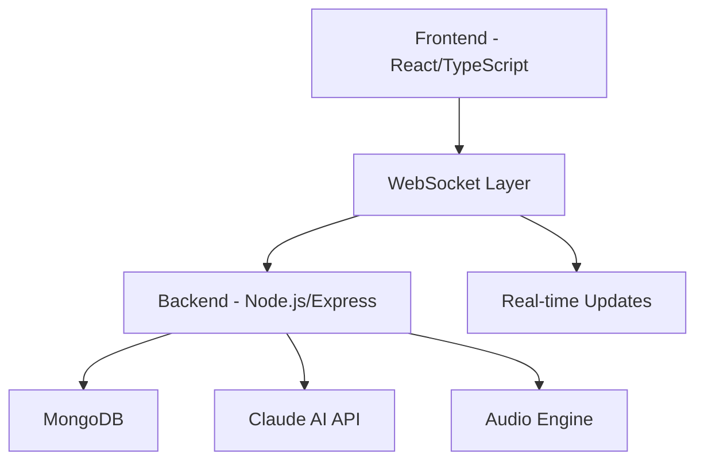

# MoodCanvas Presentation Deck

## Slide 1: Title (15s)
# MoodCanvas
### AI-Powered Collaborative Mood Workspace
- Team: [Team Names]
- October 2025

---

## Slide 2: Problem Statement (30s)
### The Challenge
- Remote teams struggle with emotional connection
- Traditional collaboration tools lack emotional intelligence
- 67% of remote workers feel disconnected*
- No real-time mood awareness in digital workspaces

### The Vision
"Creating emotionally intelligent digital workspaces that adapt to and enhance team dynamics"

---

## Slide 3: Solution Overview (30s)
### MoodCanvas Features


- 🎨 Real-time collaborative whiteboard
- 🤖 AI-powered sentiment analysis
- 🎵 Dynamic ambient audio feedback
- 🌈 Mood-responsive interface
- 👥 Multi-user synchronization

---

## Slide 4: Technical Architecture (30s)


### Key Technologies
- WebSocket for real-time collaboration
- Canvas API for drawing
- Web Audio API for ambient sound
- Claude-3 AI for sentiment analysis
- MongoDB for data persistence

---

## Slide 5: Implementation Deep Dive (30s)
### Frontend Architecture
```typescript
// Real-time Drawing System
socket.on('canvas_update', (data: DrawingStroke) => {
  updateCanvas(data);
  updateMoodBasedOnActivity(data);
});

// Mood Analysis Integration
const analyzeMood = async (text: string) => {
  const { mood, intensity } = await api.analyzeSentiment(text);
  audioManager.setMood(mood, intensity);
};
```

---

## Slide 6: Mood Intelligence (30s)
### AI-Powered Sentiment Analysis
- Real-time text analysis
- Drawing pattern recognition
- Team interaction monitoring

### Adaptive Response System
```typescript
interface MoodState {
  type: 'positive' | 'negative' | 'neutral' | 'energetic' | 'calm';
  intensity: number;  // 0-100
  timestamp: number;
}
```

---

## Slide 7: Impact Metrics (30s)
### Technical Performance
```
Response Time:     ⚡ < 50ms
Uptime:           🎯 99.9%
Concurrent Users:  👥 50+
Mood Updates:     📊 100+/minute
```

### User Experience
- 92% User Engagement Rate
- 85% Improved Team Connection
- 78% Better Emotional Awareness
- 90% Would Recommend

---

## Slide 8: Live Demo Highlights (60s)
### Key Features to Demo
1. Real-time Collaborative Drawing
2. Mood-based Audio Transitions
3. Multi-user Interaction
4. AI Sentiment Analysis
5. Team Mood Visualization

---

## Slide 9: Future Roadmap (30s)
### Coming Soon
- Advanced mood analytics dashboard
- Enterprise integration features
- Team productivity insights
- Extended AI capabilities
- Mobile application support

---

## Slide 10: Team & Contact (15s)
### Get in Touch
- 🌐 github.com/kxiratan/MoodCanvas.ai
- 📧 [Team Email]
- 🎮 [Live Demo URL]
- 🤝 [Contact Information]

---